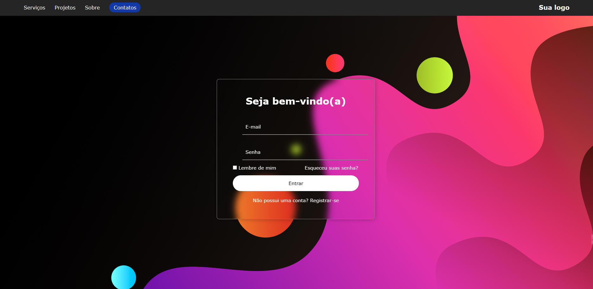

# React Login Screen

Uma tela de login moderna construída com React e Vite.

## Tecnologias utilizadas

- React
- Vite
- CSS

## Funcionalidades

- Header com navegação
- Formulário de login
- Layout com imagem de fundo
- Efeito glassmorphism no formulário

## Como rodar o projeto

Clone o repositório:

git clone https://github.com/gustavoalmeidafl/react-login-screen

Instale as dependências:

npm install

Execute o projeto:

npm run dev

## Preview

